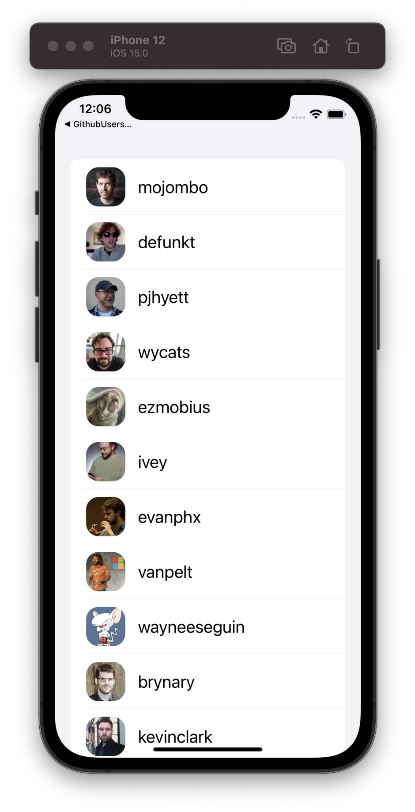

# GithubUsersSample

> Run sample need Xcode13 or newer.

Code sample for article about iOS15 new ViewModifier [*task(priority:_:)*](https://developer.apple.com/documentation/swiftui/circle/task(priority:_:)).

Article:
- [dev.to](https://dev.to/toni777772/)
- [tonidevblog](https://tonidevblog.com/posts/)
- [medium](https://toxa95401.medium.com/)

